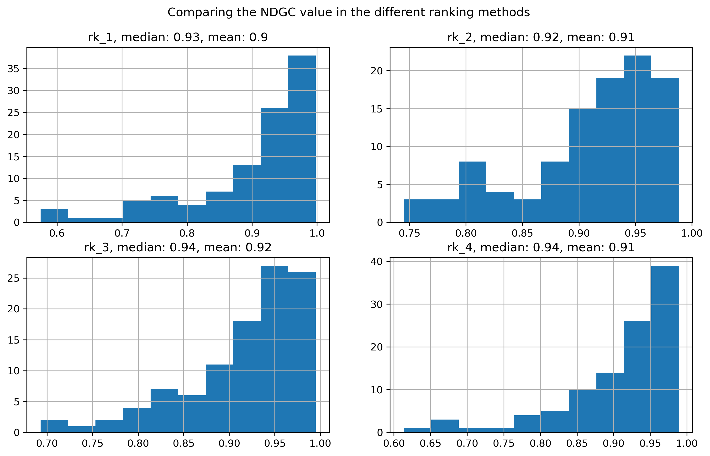
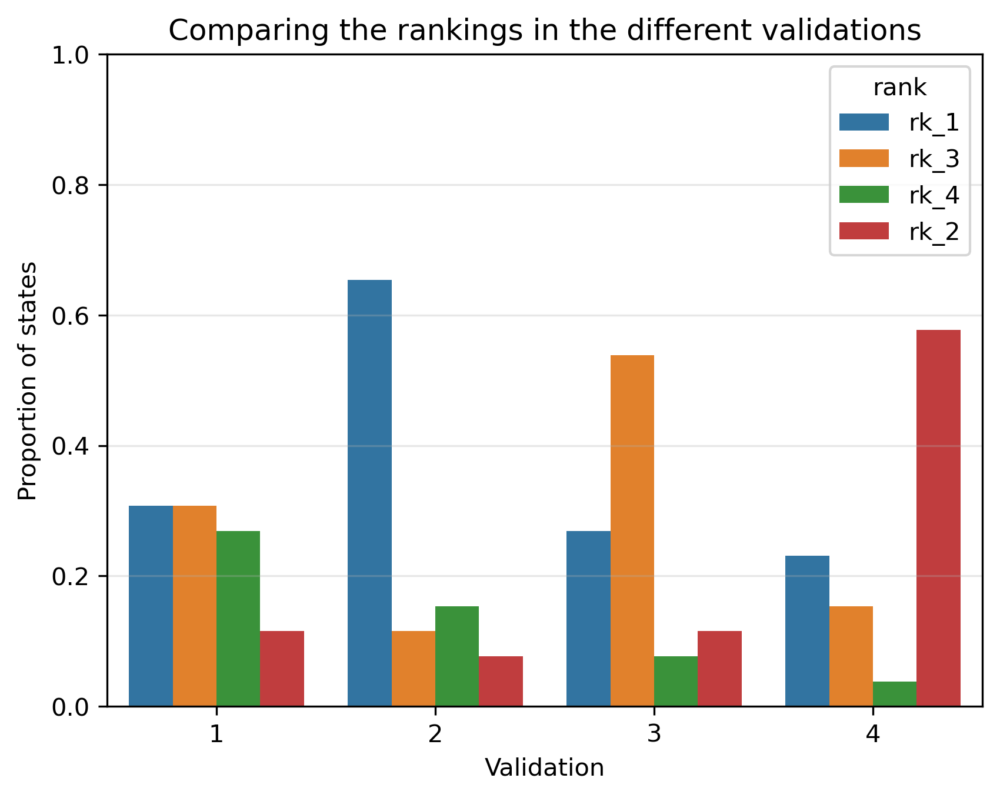
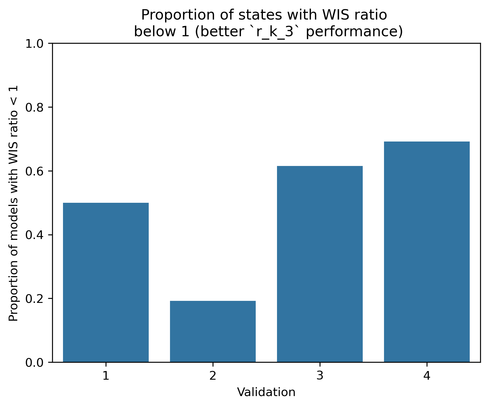

# Comparison of Global Ranking Methodologies

## Objective

Four alternative methodologies for producing a **global ranking of forecasting models** were evaluated, denoted by **rk_1**, **rk_2**, **rk_3**, and **rk_4**. The objective of this comparison was twofold.

First, the global ranking obtained for each state was used to select the top five forecasting models. A median ensemble was then constructed from these models for each validation set. Finally, the Weighted Interval Score (WIS) of the resulting ensemble forecasts was calculated for each validation set, allowing the forecasting performance of the different ranking methodologies to be compared.

As a second validation, we computed the Normalized Discounted Cumulative Gain (NDCG) to assess the agreement between each global ranking methodology and the ranking induced by WIS in each validation. The model ranks were used as the predicted scores, while the relevance of each model was defined as the inverse of its WIS (1/WIS), computed for the corresponding validation set. The NDCG was calculated using the ndcg_score function from the scikit-learn library

Together, these analyses allow us to distinguish between ranking methods that better reproduce the "ideal" ordering of models and those that ultimately lead to better forecasting performance.

---

# Ranking Agreement Assessment

## Methods

All of the ranking methodologies described below were designed to produce a **global ranking of forecasting models for each state**.

### `rk_1`

The ranking was computed using the **overall mean WIS**, calculated across all epidemiological weeks between **2022-W41** and **2026-W40**.

### `rk_2`

The ranking was computed using the **mean normalized WIS**, where the WIS in each validation set was normalized by the total number of observed cases in each validation.

### `rk_3`

The ranking was computed using the **geometric mean of the ratio between the model WIS and the baseline WIS**  (computed by each validation) across the four validation sets.

### `rk_4`

The ranking was computed using the **arithmetic mean of the WIS values** (in each validation set) across the four validation sets.

## Normalized Discounted Cumulative Gain

The similarity between the ranking produced by each methodology and the reference ranking induced by the observed WIS was quantified using the **Normalized Discounted Cumulative Gain (NDCG)**.

The Discounted Cumulative Gain (DCG) is defined as

$$
DCG=\sum_{i=1}^{n}\frac{rel_i}{\log_2(i+1)},
$$

where $rel_i$ denotes the relevance assigned to the model placed at position $i$.

The logarithmic discount assigns substantially larger importance to errors occurring near the top of the ranking, making the metric particularly suitable for model selection problems.

The ideal ranking defines the **Ideal Discounted Cumulative Gain (IDCG)**,

$$
IDCG=\max(DCG),
$$

and the normalized metric is computed as

$$
NDCG=\frac{DCG}{IDCG},
$$

whose values range from 0 to 1, with

- **1** indicating a perfect agreement with the ideal ranking;
- values close to one indicating that the best-performing models remain near the top of the list.

### Relevance Definition

Unlike classical information retrieval applications, the relevance was derived from the forecasting performance.

For each model (i) and validation set (v):

$$
rel_{i,v}=\frac{1}{WIS_{i, v}},
$$

so that models with lower WIS receive larger relevance scores.

This transformation preserves the ordering induced by WIS while naturally emphasizing models with superior predictive performance.

For every combination of **state** and **validation period**, the relevance vector computed from the observed WIS was treated as the reference ranking. The predicted global ranking generated by each methodology (`rk_1`, `rk_2`, `rk_3`, and `rk_4`) was then compared against this reference using the `ndcg_score` implementation from **scikit-learn**.

---

# NDCG Results

The NDCG analysis shows that all four methodologies produce rankings that are generally consistent with the ordering induced by the observed WIS, indicating that each strategy successfully captures the overall hierarchy of forecasting models.

However, differences become apparent when focusing on the highest-ranked models. Since NDCG discounts errors occurring in lower positions, it primarily evaluates whether the best-performing models remain concentrated near the top of the ranking.

The notebook summarizes the results through:

- mean NDCG;
- median NDCG;
- distribution of NDCG across states and validation periods.

According to both the mean and median NDCG values, `rk_3` achieved the best overall performance among the evaluated ranking methodologies.

---

# Forecasting Performance Evaluation

While NDCG evaluates ranking similarity, the ultimate objective is to improve forecasting performance.

Therefore, each global ranking methodology was used to select the highest-ranked (top 5) forecasting models, and the resulting ensembles were evaluated using the **Weighted Interval Score (WIS)** over independent validation datasets.

Unlike NDCG, which measures ranking agreement, this experiment directly evaluates the practical usefulness of each ranking methodology.

---

# WIS Comparison

Across the **104 state-validation combinations**, the ranking methodologies produced noticeably different forecasting performances.

The frequency with which each methodology achieved the lowest WIS was

| Ranking methodology | Lowest WIS (%) |
|--------------------|---------------:|
| **rk_1** | **36.5** |
| **rk_3** | **27.9** |
| **rk_2** | **22.1** |
| **rk_4** | **13.5** |

These results indicate that **rk_1 consistently produced the best forecasting performance**, outperforming the remaining methodologies in more than one-third of all evaluation scenarios.

Although **rk_3** also performed competitively, it was selected substantially less often than rk_1.

Conversely, **rk_4** rarely produced the lowest WIS, suggesting that its ranking criterion is less effective for selecting forecasting models.

Furthermore, when the results were analyzed separately for each validation set, the first validation showed a tie between `rk_1` and `rk_3`. As expected, `rk_1` was the dominant methodology in the second validation. In the third validation, `rk_3` achieved the best performance, whereas in the fourth validation, `rk_2` was the predominant methodology, followed by `rk_1` and `rk_3`. These results are illustrated in the figure below.

Additionally, we computed the WIS ratio, WIS_{rk_3}/WIS_{rk_1}, to quantify the relative performance of `rk_3` compared to `rk_1`. Ratios below one indicate improved performance of `rk_3`. The analysis shows that `rk_3` consistently outperformed or matched `rk_1` across most states and validation sets, with the exception of validation 2, where this advantage was not observed.

