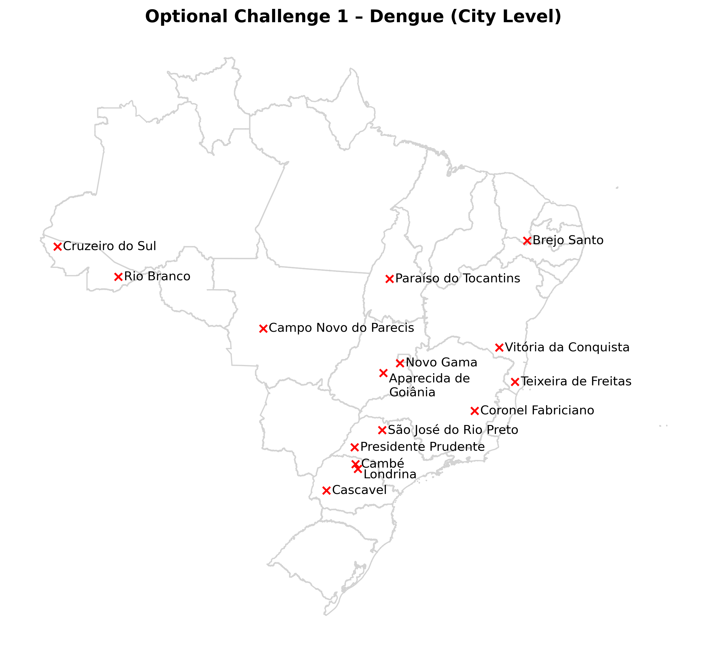
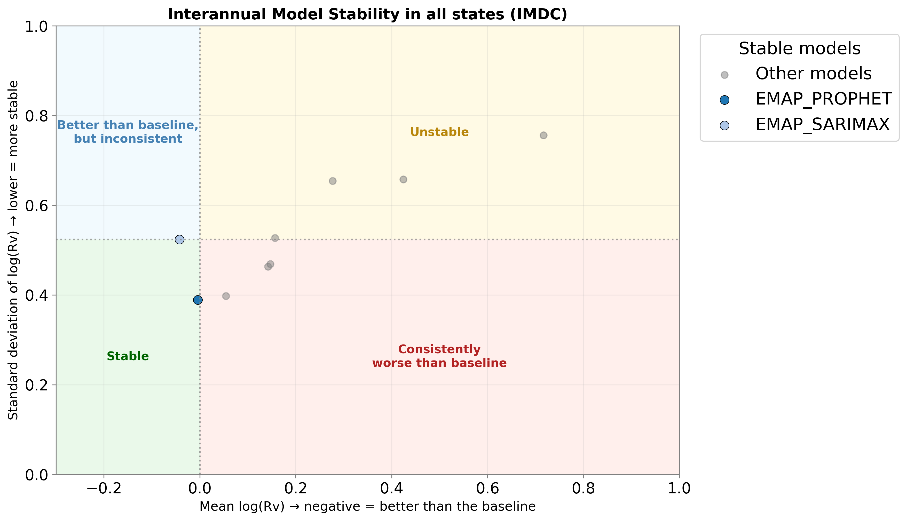
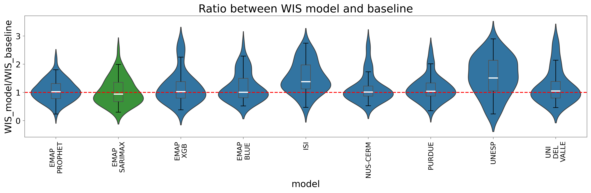
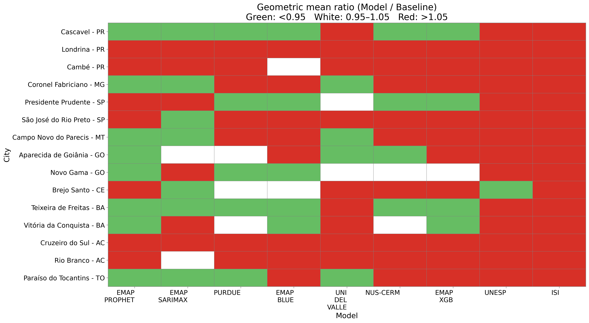
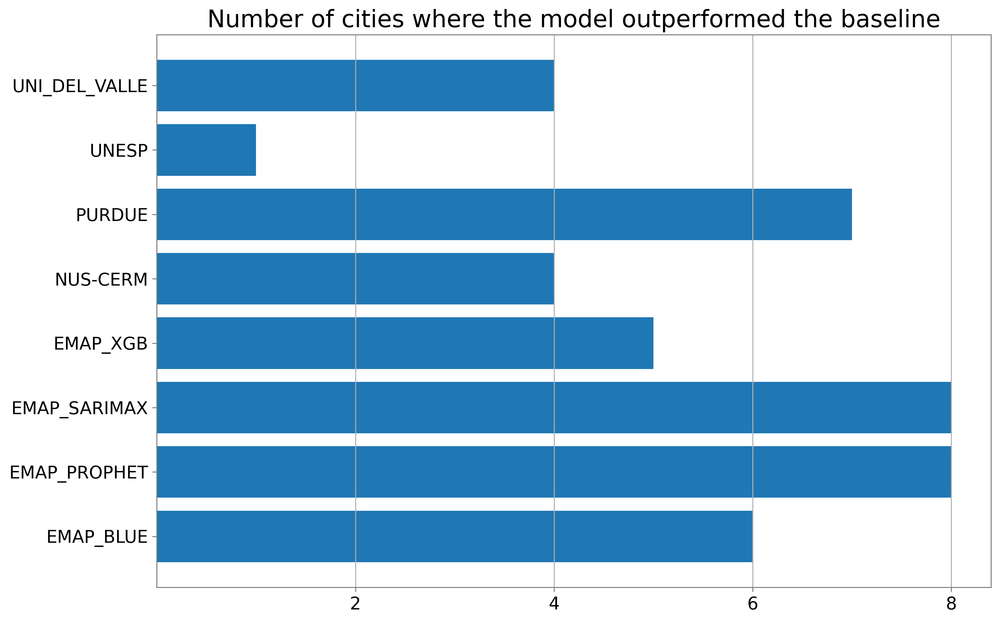
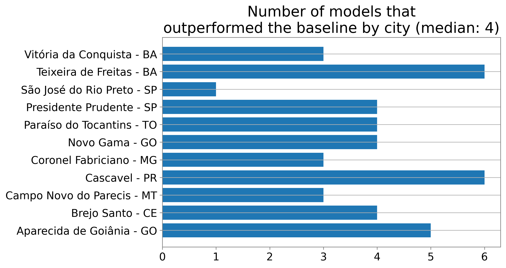
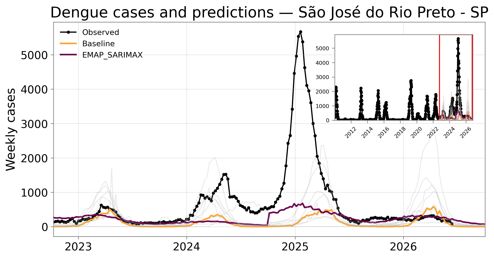
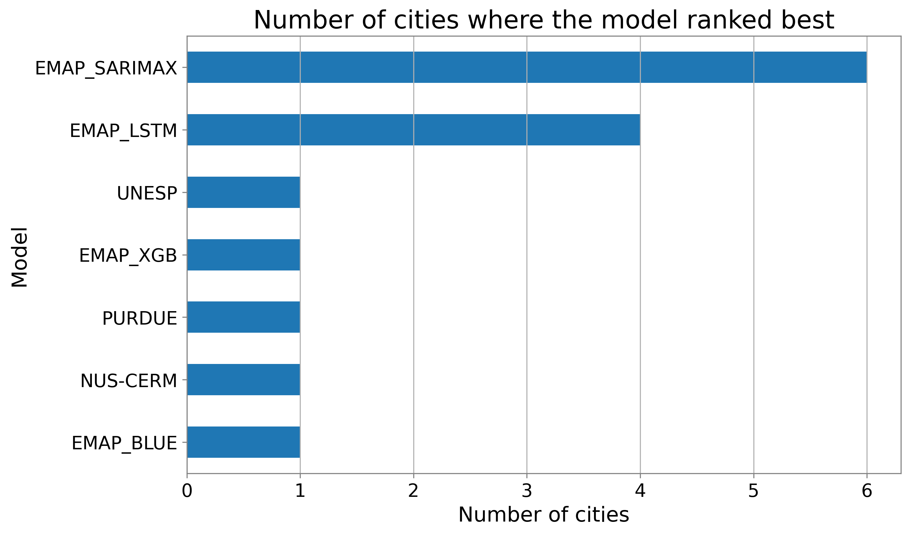
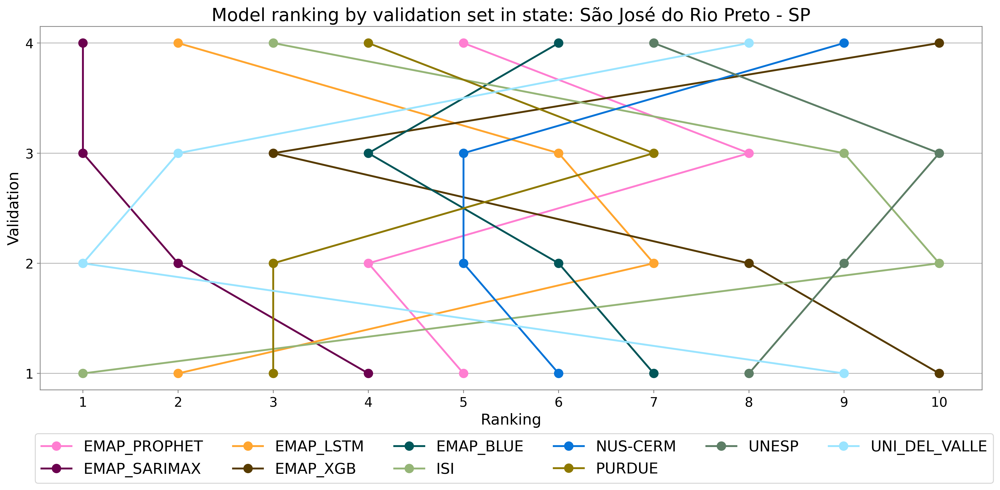
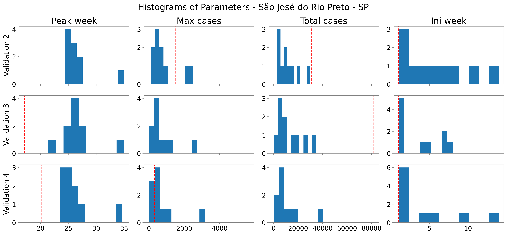

# 3rd Infodengue-Mosqlimate Dengue Challenge (IMDC): 2026 Sprint for dengue fever forecasts for Brazil

The Infodengue-Mosqlimate Dengue Challenge (IMDC) is an initiative led by the Mosqlimate and Infodengue. 

The objective of this 2026 sprint is **to promote training of predictive models and to develop high-quality ensemble forecast models for dengue in Brazil.**

The challenge involves four validation tests and one forecast target. The period of interest spans from the epidemiological week (EW) 41 of one year to EW 40 of the following year, aligning with the typical dengue season in Brazil.

**Validation test 1.** Predict the weekly number of dengue cases by state (UF) in the 2022-2023 season \[EW 41 2022- EW40 2023\], using data covering the period from EW 01 2010 to EW 25 2022;

**Validation test 2.** Predict the weekly number of dengue cases by state (UF) in the 2023-2024 season \[EW 41 2023- EW40 2024\], using data covering the period from EW 01 2010 to EW 25 2023;

**Validation test 3:** Predict the weekly number of dengue cases by state (UF) in the 2024-2025 season \[EW 41 2024- EW40 2025\], using data covering the period from EW 01 2010 to EW 25 2024;

**Validation test 4.** Predict the weekly number of dengue cases in Brazil, and by state (UF), in the 2025-2026 season \[EW 41 2025- EW40 2026\], using data covering the period from EW 01 2010 to EW 25 2025;

**Forecast.** Predict the weekly number of dengue cases in Brazil, and by state (UF), in the 2026-2027 season \[EW 41 2026- EW40 2027\], using data covering the period from EW 01 2010 to EW 25 2026;

The challenge workflow, from data release to the generation of the ensemble models, was identical to that of the first edition, as described by Araujo et al. (2026). In addition, this year, the competition included four forecasting challenges:

* **Mandatory Challenge – Dengue (State Level)**: Forecast dengue cases at the state (UF) level for all Brazilian states, except Espírito Santo.

* **Optional Challenge 1 – Dengue (City Level)**: Forecast dengue cases for 15 selected cities.

* **Optional Challenge 2 – Chikungunya (State Level)**: Forecast chikungunya cases at the state (UF) level for all Brazilian states, except Espírito Santo.

* **Optional Challenge 3 – Chikungunya (City Level)**: Forecast chikungunya cases for 10 selected cities.

This document presents the results for the **Optional Challenge 1 – Dengue (City Level)**. The results for the other challenges are available in the following files:

* [Mandatory Challenge - Dengue state](readme.md).
* [Optional Challenge 2 - Chikungunya state](optional_challenge_2.md).
* [Optional Challenge 3 - Chikungunya city](optional_challenge_3.md).

# Results - Optional challenge 1: Dengue city level 

Forecast dengue cases for 15 selected cities:

* Teixeira de Freitas (BA) - geocode: 2931350
* Vitória da Conquista (BA) - geocode: 2933307
* Brejo Santo (CE) - geocode: 2302503
* Coronel Fabriciano (MG) - geocode: 3119401
* São José do Rio Preto (SP) - geocode: 3549805
* Presidente Prudente (SP) - geocode: 3541406
* Rio Branco (AC) - geocode: 1200401
* Cruzeiro do Sul (AC) - geocode: 1200203
* Paraíso do Tocantins (TO) - geocode: 1716109
* Londrina (PR) - geocode: 4113700
* Cambé (PR) - geocode: 4103701
* Cascavel (PR) - geocode: 4104808
* Aparecida de Goiânia (GO) - geocode: 5201405
* Campo Novo do Parecis (MT) - geocode: 5102637
* Novo Gama (GO) - geocode: 5215231

## Teams and models 

| Team | Institution | Country | Repository | Label in plots |
|------|-------------|---------|------------|---------------|
| Epidemáticos - Prophet | FGV EMAp | Brazil | https://github.com/EzequielEBS/3rd_imdc_emap_epidematicos_prophet | EMAP_PROPHET | 
| Epidemáticos - Sarimax | FGV EMAp | Brazil | https://github.com/EzequielEBS/3rd_imdc_emap_epidematicos_sarimax_muni | EMAP_SARIMAX | 
| NUS CERM| National University of Singapore | Singapore |https://github.com/SungmokJung/3rd_imdc_nus_nus-cerm| NUS-CERM| 
| XGBSillas | FGV-EMAP | Brazil | https://github.com/scrocha/3rd_imdc_emap_xgbsillas | EMAP_XGB |
| ISI Dengue | ISI Foundation | Italy | https://github.com/mattiamazzoli/3rd_imdc_isi_isi-dengue | ISI | 
| Dengue Oracle | FGV-EMAP | Brazil | https://github.com/eduardocorrearaujo/3rd_imdc_emap_lstm_muni | EMAP_LSTM | 
| Pattern-Blue | FGV-EMAP | Brazil | https://github.com/ZuilhoSe/3rd_imdc_fgv_pattern-blue | EMAP_BLUE | 
| Grupo Modelamiento de datos en Dengue | Universidad del Valle | Colombia | https://github.com/germanavila09/3rd_imdc_universidad_del_valle_grupo_modelamiento_datos_dengue | 
| Neural Earth | Purdue University | United States |https://github.com/kamrul28890/3rd_imdc_purdue_neuralearth | PURDUE | 
| Recogna | UNESP | Brazil | https://github.com/joel-da-silva-cavalcanti-filho/3rd_imdc_unesp_recogna | UNESP | 

## Ranking and Scoring 

Model performance was evaluated using the **Weighted Interval Score (WIS)**, a proper scoring rule for probabilistic forecasts. To facilitate comparisons across models and states, we expressed the performance of each model relative to a baseline forecast by computing the ratio between its WIS and the WIS of a baseline model.

The baseline model adopted in this study was **Dengue Oracle** model. For each validation period (v), the relative performance was computed as

$$ R_v = \frac{\mathrm{WIS}{\mathrm{model},v}}{\mathrm{WIS}{\mathrm{baseline},v}}.$$

Values of **($R_v$ < 1)** indicate that the model **outperformed** the baseline, whereas values of **($R_v$ > 1)** indicate **inferior predictive performance**.

To summarize model performance across the four validation periods, we computed the **geometric mean** of ($R_v$) for each model within each city. Models were then ranked independently for each city according to this aggregated score, with lower values indicating better overall predictive performance.

The Weighted Interval Score was computed as

$$\mathrm{WIS}(F, y) =
\frac{1}{K + \tfrac{1}{2}}
\left(
w_0 |y - m|
+
\sum_{k=1}^{K}
w_k
S_{\alpha_k}^{\mathrm{int}}(l_k, u_k; y)
\right),$$

where ($y$) is the observed value, ($m$) is the predictive median, ($K$) is the number of prediction intervals, and ($l_k$) and ($u_k$) denote the lower and upper bounds of the (k)-th prediction interval with nominal level ($1-\alpha_k$), respectively. The interval weights are defined as ($w_k = \alpha_k/2$), while the median receives weight ($w_0 = 1/2$).

## Overall model performance relative to the baseline

### Scatter plot 

The figure below presents a scatter plot summarizing the overall performance of all submitted models across all cities and validation periods. For each model, the (x)-axis represents the mean of ($\log(R_v)$), which is equivalent to the logarithm of the geometric mean of ($R_v$). The (y)-axis represents the standard deviation of ($\log(R_v)$), providing a measure of the variability of the model's relative performance across cities and validation periods.

This visualization allows models to be classified into four performance regions:

* **Stable (green):** Models with a mean ($\log(R_v) < 0$), indicating that they outperform the baseline on average, and a standard deviation of ($\log(R_v)$) below the median, indicating relatively consistent performance across cities and validation periods.

* **Better than the baseline, but inconsistent (blue):** Models with a mean ($\log(R_v) < 0$), indicating better average performance than the baseline, but with a standard deviation of ($\log(R_v)$) above the median, suggesting substantial variability in performance across cities or validation periods.

* **Unstable (yellow):** Models with a mean ($\log(R_v) > 0$), indicating worse average performance than the baseline, and a standard deviation of ($\log(R_v)$) above the median, reflecting inconsistent performance across cities or validation periods.

* **Consistently worse than the baseline (red):** Models with a mean ($\log(R_v) > 0$), indicating worse average performance than the baseline, and a standard deviation of ($\log(R_v)$) below the median, indicating consistently poor performance.

To improve readability, only models located in the **Stable** region are highlighted using distinct colors, as indicated in the legend. All remaining models are shown in gray.

### Violin plots 
In addition to the scatter plot, we generated violin plots to further characterize the distribution of ($R_v$) values across all models. The plots were produced using data from all selected cities combined.

## City performance 

### Heatmaps
To visualize model performance across cities, we created the heatmap shown below. In this figure, each row represents a city and each column represents a forecasting model. Each cell displays the geometric mean of ($R_v)$ across the four validation periods for the corresponding city-model combination.

Cells are colored according to the model's relative performance: **green** indicates a geometric mean of (R_v < 0.95), corresponding to performance substantially better than the baseline; **white** indicates values between 0.95 and 1.05, corresponding to performance comparable to the baseline; and **red** indicates values greater than 1.05, corresponding to performance worse than the baseline.

Models are ordered from left to right according to the number of green cells, with the best-performing models appearing first.

The value of this metric for each city and model is presented in this additional file [Supplementary Material](figures/sup_mat_dengue_city.md). 

As a complement to the heatmaps, we generated the figures below, considering only models with a geometric mean of ($R_v < 1$) for each city.

The first figure shows the number of cities in which each model outperformed the baseline, providing an overall measure of model robustness across the cities.

The second figure shows, for each city, the number of models that outperformed the baseline. This visualization helps identify cities where accurate forecasting was more challenging, as indicated by a smaller number of models surpassing the baseline.

Based on these results, we selected **São José do Rio Preto (SP)** for a more detailed analysis. The figures below compare the observed epidemic curves (black lines) with forecasts from the baseline model and the models that achieved better performance than the baseline. These models are highlighted using distinct colors, while all remaining models are shown in gray.

The figure above are available for the other cities
in this additional file [Supplementary Material](figures/sup_mat_dengue_city.md).

### Best-performing models per city

The bar chart below shows the number of cities in which each model achieved the highest overall ranking, based on the geometric mean of the relative Weighted Interval Score ($R_v$) across the four validation periods.

The table below illustrates the best-performing model in each city.

| City | Model | 
|------|--------|
|Cruzeiro do Sul - AC	|EMAP_LSTM|
|Rio Branco - AC|	EMAP_LSTM|
|Paraíso do Tocantins - TO	|EMAP_SARIMAX|
|Brejo Santo - CE	|UNESP|
|Teixeira de Freitas - BA|	EMAP_SARIMAX|
|Vitória da Conquista - BA|	EMAP_XGB|
|Coronel Fabriciano - MG	|EMAP_SARIMAX|
|Presidente Prudente - SP|	PURDUE|
|São José do Rio Preto - SP	|EMAP_SARIMAX|
|Cambé - PR	|EMAP_LSTM|
|Cascavel - PR|	EMAP_SARIMAX|
|Londrina - PR	|EMAP_LSTM|
|Campo Novo do Parecis - MT|	EMAP_SARIMAX|
|Aparecida de Goiânia - GO|	NUS-CERM|
|Novo Gama - GO	EMAP_BLUE|

## Performance by city - all validations 

To complement the overall analysis, the figures below illustrate model performance across the individual validation periods. In these plots, the y-axis represents the validation periods, while the x-axis displays the model ranking for each validation period. Each colored line corresponds to a different forecasting model, making it possible to assess the consistency of model performance over time and identify models whose rankings or relative performance vary substantially between validation periods.

The figure above presents the results for **São José do Rio Preto (SP)**. Equivalent visualizations for all other cities are provided in the [Supplementary Material](figures/sup_mat_dengue_city.md).

## Epidemic characteristics

Additionally, using the copula-based approach described below, we transformed each model forecast into the parameters of a log-normal distribution. From these distributions, we generated 1,000 samples for each forecast and estimated four epidemic characteristics: the total number of cases, the maximum weekly number of cases (peak intensity), the peak week, and the epidemic onset week, together with their corresponding confidence intervals. The peak week and epidemic onset week were estimated by fitting a Richards growth model to the sampled trajectories, following the methodology proposed by Araujo et al. (2025).

The figures below present the distributions of the estimated epidemic characteristics for each validation period and forecasting model. In each histogram, the red dashed line indicates the observed value, while the blue bars represent the median estimate produced by each model. Results are shown beginning with Validation 2, as estimation of the copula parameter (\rho) requires information from the preceding validation period.

The figure below summarizes the estimated epidemic characteristics for **São José do Rio Preto (SP)**. Equivalent visualizations for all other Brazilian cities are available in the [Supplementary Material](figures/sup_mat_dengue_city.md).

## References 

Freitas, Laís Picinini, et al. "A statistical model for forecasting probabilistic epidemic bands for dengue cases in Brazil." Infectious Disease Modelling (2025).

Araujo, Eduardo C., et al. "Large-scale epidemiological modelling: scanning for mosquito-borne diseases spatio-temporal patterns in Brazil." Royal Society Open Science 12.5 (2025): 1-13

Araujo, Eduardo C., et al. "Leveraging Probabilistic Forecasts for Dengue Preparedness and Control: The 2024 Dengue Forecasting Sprint in Brazil." Proceedings of the National Academy of Sciences of the United States of America, vol. 123, no. 7, 2026, e2508989123. https://doi.org/10.1073/pnas.2508989123.