# 3rd Infodengue-Mosqlimate Dengue Challenge (IMDC): 2026 Sprint for dengue fever forecasts for Brazil

The Infodengue-Mosqlimate Dengue Challenge (IMDC) is an initiative led by the Mosqlimate and Infodengue in collaboration with the Harmonize and IDExtremes projects.

The objective of this 2026 sprint is **to promote training of predictive models and to develop high-quality ensemble forecast models for dengue in Brazil.**

The challenge involves four validation tests and one forecast target. The period of interest spans from the epidemiological week (EW) 41 of one year to EW 40 of the following year, aligning with the typical dengue season in Brazil.

**Validation test 1.** Predict the weekly number of dengue cases by state (UF) in the 2022-2023 season \[EW 41 2022- EW40 2023\], using data covering the period from EW 01 2010 to EW 25 2022;

**Validation test 2.** Predict the weekly number of dengue cases by state (UF) in the 2023-2024 season \[EW 41 2023- EW40 2024\], using data covering the period from EW 01 2010 to EW 25 2023;

**Validation test 3:** Predict the weekly number of dengue cases by state (UF) in the 2024-2025 season \[EW 41 2024- EW40 2025\], using data covering the period from EW 01 2010 to EW 25 2024;

**Validation test 4.** Predict the weekly number of dengue cases in Brazil, and by state (UF), in the 2025-2026 season \[EW 41 2025- EW40 2026\], using data covering the period from EW 01 2010 to EW 25 2025;

**Forecast.** Predict the weekly number of dengue cases in Brazil, and by state (UF), in the 2026-2027 season \[EW 41 2026- EW40 2027\], using data covering the period from EW 01 2010 to EW 25 2026;

This year, the competition included four forecasting challenges:

* **Mandatory Challenge – Dengue (State Level)**: Forecast dengue cases at the state (UF) level for all Brazilian states, except Espírito Santo.

* **Optional Challenge 1 – Dengue (City Level)**: Forecast dengue cases for 15 selected cities.

* **Optional Challenge 2 – Chikungunya (State Level)**: Forecast chikungunya cases at the state (UF) level for all Brazilian states, except Espírito Santo.

* **Optional Challenge 3 – Chikungunya (City Level)**: Forecast chikungunya cases for 10 selected cities.

This document presents the results for the **Mandatory Challenge (Dengue – State Level)**. The results for the optional challenges are available in the following files:

* `optional_challenge_1.md` – Dengue (City Level)
* `optional_challenge_2.md` – Chikungunya (State Level)
* `optional_challenge_3.md` – Chikungunya (City Level)

## Teams and models 

| Team | Institution | Country | Repository | Label in plots |
|------|-------------|---------|------------|---------------|
| Global Health Resilience (GHR) | Barcelona Supercomputing Center | Spain | https://github.com/dievillano/3rd_imdc_bsc_ghr | BSC |
| Cornell-PEH | Cornell University | United States | https://mosqlimate.org/BentoLab-DiseaseDynamics/3rd_imdc_cornell_bentolab | CORNELL | 
| LNCC ARP26 | Laboratório Nacional de Computação Científica | Brazil | https://github.com/pesquefGH/3rd_imdc_lncc_lncc_arp26_dengue | LNCC_ARP26 | 
| LNCC SURGE | Laboratório Nacional de Computação Científica | Brazil |https://github.com/pesquefGH/3rd_imdc_lncc_surge_model26_dengue | LNCC_SURGE | 
| LNCC CLIDENGO | Laboratório Nacional de Computação Científica | Brazil |https://github.com/americocunhajr/3rd_imdc_lncc_clidengo26dengue | LNCC_CLIDENGO | 
| Epidemáticos - Prophet | FGV EMAp | Brazil | https://github.com/EzequielEBS/3rd_imdc_emap_epidematicos_prophet | EMAP_PROPHET | 
| Epidemáticos - Sarimax | FGV EMAp | Brazil | https://github.com/EzequielEBS/3rd_imdc_emap_epidematicos_sarimax_state | EMAP_SARIMAX | 
| Grupo Modelamiento de datos en Dengue | Universidad del Valle | Colombia | https://github.com/germanavila09/3rd_imdc_universidad_del_valle_grupo_modelamiento_datos_dengue | UNI_DEL_VALLE | 
| InfraMIND | IFGW Unicamp and BIFI Universidad de Zaragoza | Brazil | https://github.com/InfraMIND-models/3rd_imdc_ifgw_inframind-proteus | IFGW | 
| ISI Dengue | ISI Foundation | Italy | https://github.com/mattiamazzoli/3rd_imdc_isi_isi-dengue | ISI | 
| MARD | Fiocruz | Brazil | https://github.com/asgouveiaa/3rd_imdc_fiocruz_mard | FIOCRUZ_MARD |
| Return of the Forecast | Centre for Epidemic Response & Innovation (CERI) | South Africa | https://github.com/CERI-KRISP/CERI_Dengue_Forecasting_2026 | CERI | 
| RKI_ZKI_LSTM_GEO | RKI | Germany | https://github.com/DiogoParreira/3rd_imdc_rki_rki_zki_ph_lstm_geo | RKI_LSTM |
| RKI_ZKI_PH | RKI | Germany | https://github.com/DiogoParreira/3rd_imdc_rki_rki_zki_ph | RKI_PH |
| NOIS PUC Arbocaster | Pontifical Catholic University of Rio de Janeiro (PUC-Rio) | Brazil | https://github.com/Dududidicao99/3rd_imdc_pucrio_arbocaster | PUCRIO | 
| Recogna | UNESP | Brazil | https://github.com/joel-da-silva-cavalcanti-filho/3rd_imdc_unesp_recogna | UNESP | 
| XGBSillas | FGV-EMAP | Brazil | https://github.com/scrocha/3rd_imdc_emap_xgbsillas | EMAP_XGB |
| SAKHAL | FGV-EMAP | Brazil | https://github.com/marciomacielbastos/3rd_imdc_fgv_sakhal | EMAP_SAKHAL |
| ZEROLAGS | FIOCRUZ | Brazil | https://github.com/Luizsrs/3rd_imdc_fiocruz_zerolags | FIOCRUZ_ZEROLAGS |
| Pattern-Blue | FGV-EMAP | Brazil | https://github.com/ZuilhoSe/3rd_imdc_fgv_pattern-blue | EMAP_BLUE | 
| Dengue Oracle | FGV-EMAP | Brazil | https://github.com/eduardocorrearaujo/3rd_imdc_emap_lstm_muni | EMAP_LSTM | 
| Neural Earth | Purdue University | United States |https://github.com/kamrul28890/3rd_imdc_purdue_neuralearth | PURDUE | 
| BB model | PROCC | Brazil |https://github.com/lsbastos/3rd_imdc_procc_bb_model| PROCC| 
| DS-OKSTATE-26 | Oklahoma State University | United States |https://github.com/haridas-das/DS-OKSTATE-2026| DS-OKSTATE| 
| NUS CERM| National University of Singapore | Singapore |https://github.com/SungmokJung/3rd_imdc_nus_nus-cerm| NUS-CERM| 
| AFYA| Afya | Brazil |https://github.com/Ricafya/3rd_imdc_afya_ric| AFYA| 

## Ranking

To rank the models, we computed the ratio between each model's Weighted Interval Score (WIS) and the WIS of a baseline model. As the baseline, we used the **BB** model, which is described in the following publication: https://www.sciencedirect.com/science/article/pii/S2468042725000739.

For each validation period ($v$), the ratio was calculated as

$$R_v = \frac{\mathrm{WIS}_{\mathrm{model},v}}{\mathrm{WIS}_{\mathrm{baseline},v}}.$$

A value of ($R_v < 1$) indicates that the model outperformed the baseline, while ($R_v > 1$) indicates worse performance.

To obtain a state-level ranking, we computed the geometric mean of (R_v) across the four validation periods for each model. Models were then ranked within each state according to this metric, with lower values indicating better predictive performance.

### Best-performing models per state

The bar plot below shows the number of states in which each model achieved the highest rank.

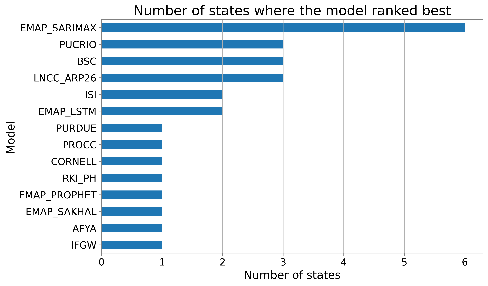

The map below displays the top-ranked model for each state. States are colored according to the model that achieved the best ranking.

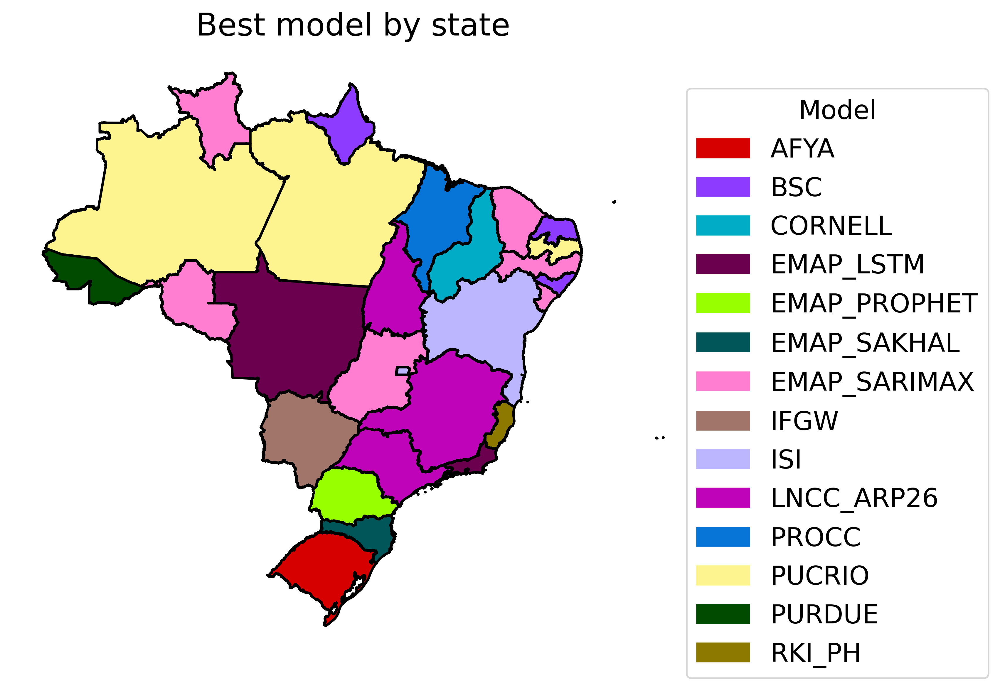

The figures below present, for each region, the three highest-ranked models based on their performance in each state (using $\text{WIS}^{\text{norm}}$).

### Medal board 
#### South region: 

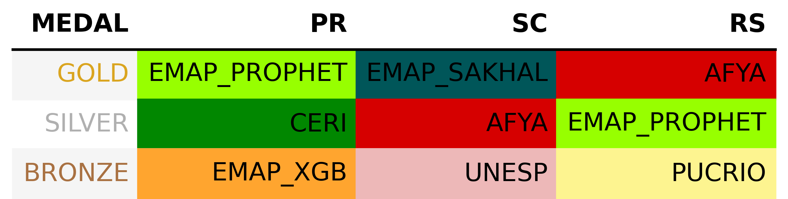

#### Southeast region: 

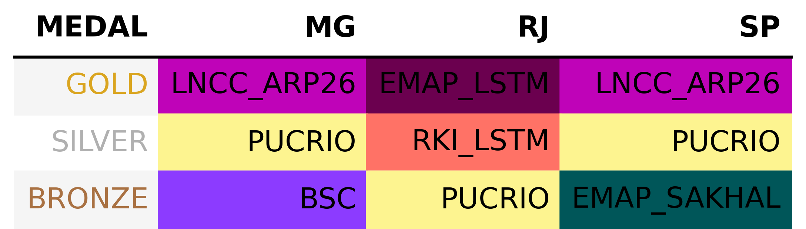

#### Midwest region: 

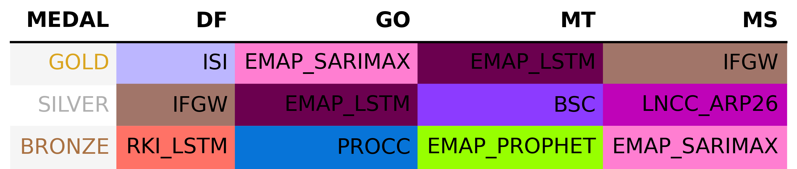

#### Northeast region: 

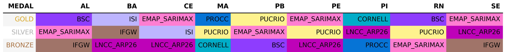

#### North region: 

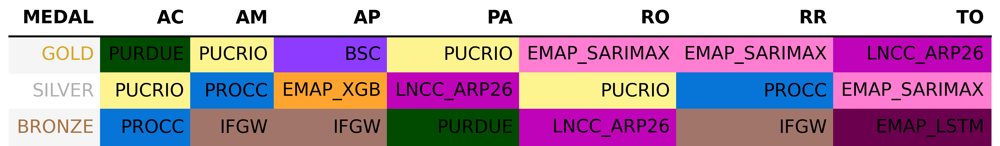

### Overall model performance 

Filtering by the models with mean $R_v < 1$ by state we generated the following plots: 

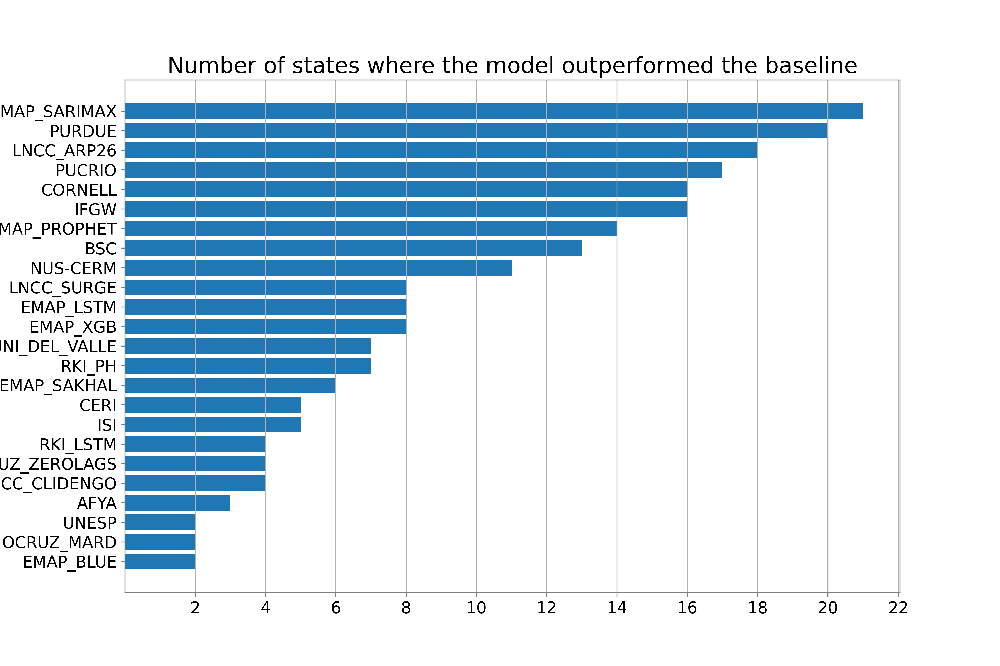

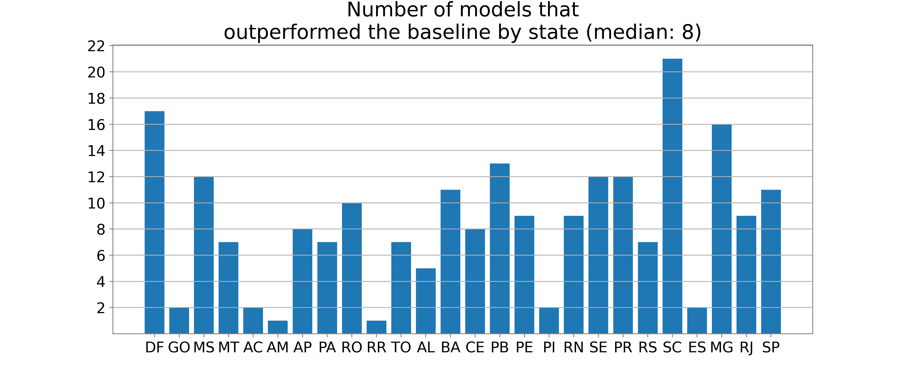

The violin plots below show the distribution of the performance ratio ((R)) across all validation periods. This analysis can be performed using data from all states, as shown below,

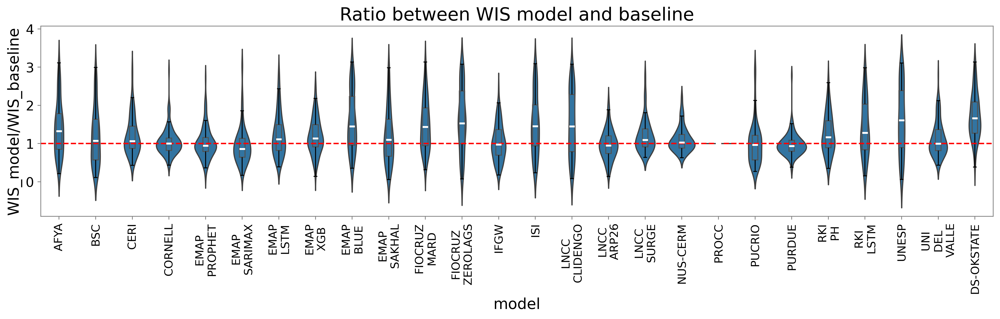

or restricted to a specific region, such as the Southeast:

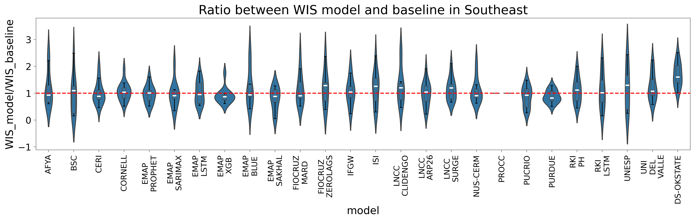

### Heatmap by region 

The figures below show the mean performance ratio for each state, grouped by Brazilian region.

#### South region: 

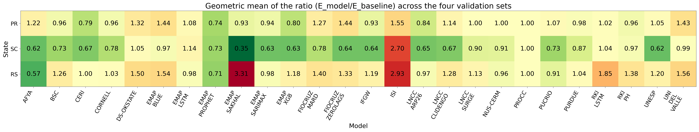

#### Southeast region: 

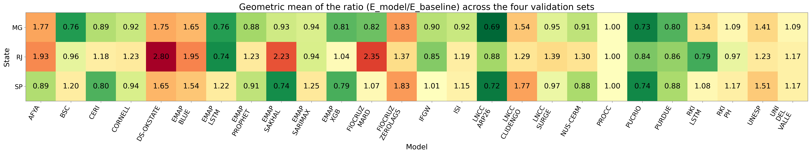

#### Midwest region: 

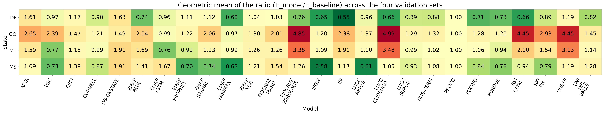

#### Northeast region: 

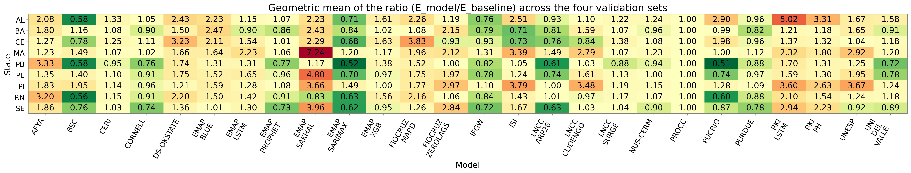

#### North region: 

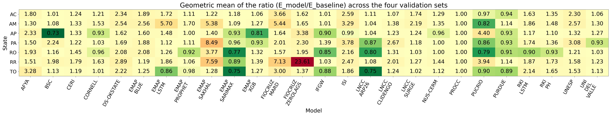

## Performance by state - all validations 

To complement the analysis above, the following plots can be used to show the model performance across validation sets. The validation set is displayed on the y-axis, while either the ranking or the performance ratio for each validation period is shown on the x-axis. Each colored line represents a different model, allowing for a comparison of their performance consistency across validation periods.

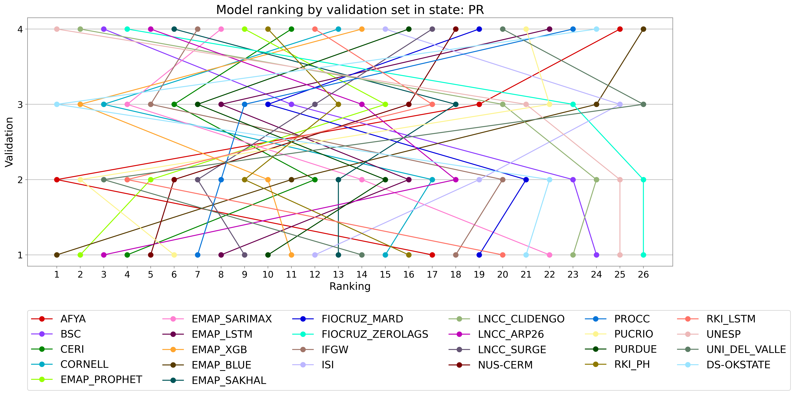

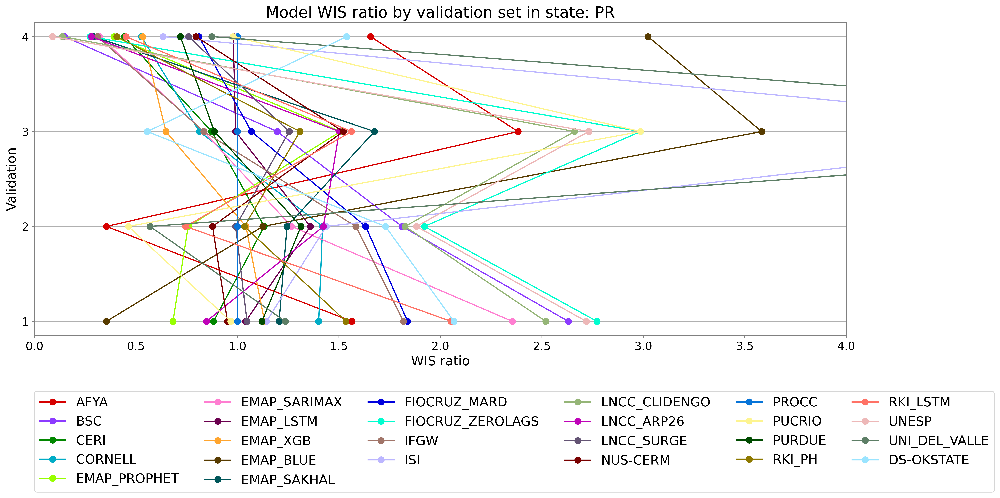

## New metrics 

Additionally, using the copula-based method described below, we transformed each model forecast into log-normal distribution parameters. We then generated 1,000 samples from these distributions and computed the total number of cases and the maximum number of cases, including their corresponding confidence intervals.

From the generated samples, we selected 100 samples and fitted the Richards model to estimate the peak week.

The plots below show the histogram distributions of each estimated parameter for each validation period. The red dashed line indicates the observed value from the data. The parameters are shown starting from validation 2 because one validation period is required to estimate the (\rho) parameter used in the copula method.

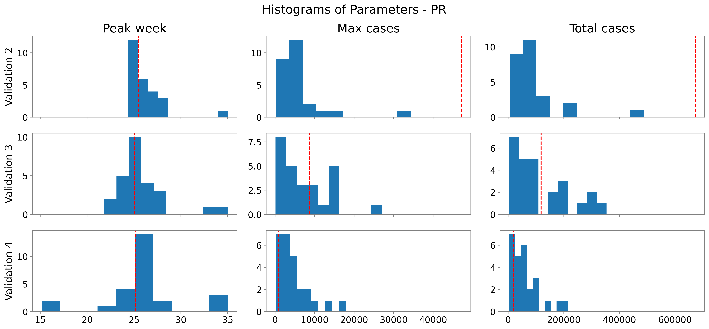
